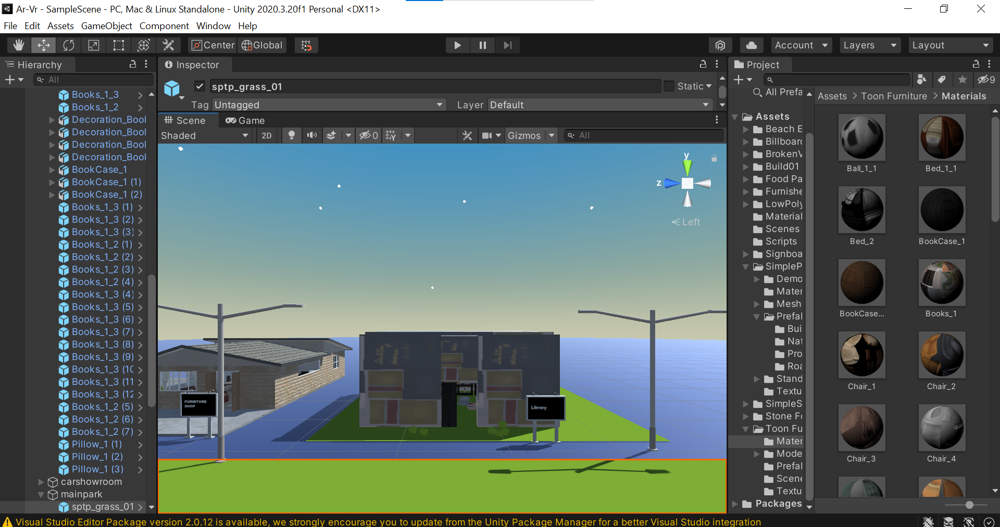

# Shopping Market

## Problem Statement 
- The pandemic has drastically changed the world we live in. It has become evident that this phase of human evolution will be the tipping point in the history of our planet. Even though we have lost a certain sense of reality in these unprecedented times and we crave the normalcy that we had, a sector that has flourished despite the tough times is the tech world. Not only has it improved accessibility to certain environments but it is also able to give a human touch to the digital world with the incorporation of augmented and virtual reality. AR VR has allowed us to immerse ourselves in a world of fantasy and for a brief while perhaps forget about our current mundane lives. In this project we aim to improve the user shopping experience through smart technologies that make shopping from home a pleasant experience. Our first project is aimed at improving real time information on availability of goods in a rural town that has access to limited supply. This allows users to only step outside when they are sure that the goods they desire are not out of stock and are readily available. 

## Design
- VR marketplace was designed to make shopping experience more seamless and to decrease crowding as users can check availability of products before they visit the market which saves man resources. The project was first planned and all requirements such as the assets and tools required were downloaded and set up on the local system. All assets and their prefabs were downloaded and imported into project space. Once the import was completed, each prefab was placed in the scene and it was assigned its physical properties followed by the addition of directional lighting around the object. The user is then placed at an appropriate place in the scene and C# scripts were added to objects for collision, movement etc.

## Tools used
- UNITY3D: Unity3D is a powerful cross-platform 3D engine and a user friendly development environment. Easy enough for the beginner and powerful enough for the expert; Unity should interest anybody who wants to easily create 3D games and applications for mobile, desktop, the web, and consoles. Hence, it was our first choice at building an application, be it for the PC or mobile environment. Using UNITY3D, we first built a virtual Market Centre from scratch using models downloaded from the UNITY marketplace. This gave us freedom to choose over a large variety of models thus leading to the different shops on site at the market centre.We put directional lighting around the object after placing the prefab in our scene and assigning it physical parameters. The user was then placed in an appropriate location in the scene, and C# Scripts were attached to objects for collision and movement.

## Sample
- As in any other marketplace, our VR marketplace features a variety of markets starting from clothes and fashion, to furniture and a car showroom as well. The marketplace is surrounded by a dome that gives it the lighting and atmosphere, inside which there is a parking lot and a common area featuring fountains and benches. The user can go to individual shops in order to view products he or she is interested in. This gives them an idea about how the product looks without leaving the comfort of their house. 

  
   
  

  
   
  

  
   
  

